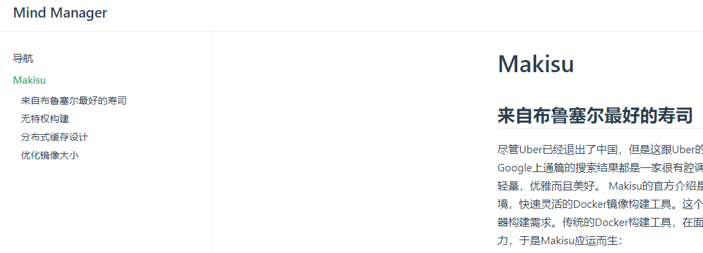

<!--看烦了千篇一律的Hex或者Jetty的博客？想要个性化定制自己的样式？VUE将无所不能。-->
<!-- more -->

# 构建自己的VUE博客

## github.io
搞IT日子久了，总会有想法写点自己的东西，不管是分享还是**炫耀**。常用的博客有那么几种，
一开始或许会选择CSDN或者stackOverFlow，然而日子久了总觉得缺点逼格。拥有一个自己的博客来维护和
写文章成了广大人民群众的追求。这边文章会教大家如何快速高效无污染地搭建一个属于自己的个人博客。

第一步，打开阿里云，买一个DES服务器。


OK,OK。什么都可以谈，就是不能谈钱。好在全世界最大的同性交友网站**GitHub**为广大贫困人民提供了
一个免费的博客空间，只需要用你的用户名带上后缀域名就可以访问了，比如

https://sejta.github.io

进入自己的GitHub主页，选择**Your repositories**


然后点击new，新建一个以 自己的账号名称.github.io 的项目。如下图


建立完成之后，你只需要在根目录下建立一个index.html文件，理论上直接访问

https://自己的账号名称.github.io

就已经可以到刚才新建的html页面了。好了本篇教程到此结束我们下期再见。


>注意，GitHub提供的博客只支持静态的页面，也就是纯的HTML DOM结构和JavaScript,
没有数据库和服务器的支持。
>百度上有很多关于GitHub搭建博客的教程，大多数都是依赖于Jetty或者Hex架构搭建的，
Jetty这个玩意，懂得人真的不多，定制性低，很多时候仅仅只能用来做一个同类的博客。

那么，除了Jetty之外，还有没有更好的搭建静态页面的工具呢。

## vuePress

OK我承认，我是VUE吹。我大VUE万法不侵无所不能上天入地。。。


好了回归正经，VUE在很早之前就有**SSR**(服务器静态页面渲染)的技术。这涉及到VUE的原理层，
这里稍微提一下。VUE本身的引擎是单页面应用，整个DOM结构只有一个简单的HTML，所有业务层逻辑
都依赖于JS的动态操作。然而这对于SEO来说是毁灭性的，爬虫不能有效提取页面元素来进行排序。
所以VUE提供了SSR技术，用于将网站的几个重要页面在服务器端静态渲染掉，一方面可以加快
前端初次访问的加载速度，有效降低Scripting脚本执行时间，另一方面也可以契合爬虫来执行关键字抓取。

我们搭建博客，当然希望可以长期简单化地工作。希望VUE能够读取某种格式的文字，将他们自动
转化成HTML静态文件，最终生成博客的内容。这里选择使用**MarkDown**格式的文件作为博客文章
的主要载体。至于为什么，因为**Word 根本不是世界上最好的文档语言，MarkDown才是。**

至于MarkDown怎么写，请自行百度。

现在有请今天的主角--vuePress。这个工具其实是一个VUE+WebPack4.0+SSR+MarkDown解析工具的整合
软件，利用VueRouter，在解析好的MarkDown文档之间进行跳转。具体的实现可以去查看官网教程，这里就不
详说了，直接进入正题系列之这玩意怎么用。

## 搭建

首先新建一个项目文件夹，建议在新建的项目里进行操作，然后在空的文件夹中执行

```
npm i vuepress -g
```

将VuePress安装到全局，然后执行

```
npm init
```

得到一个**packge.json**文件，打开这个文件，把里面的scripts选项改成以下这样:


```
 "scripts": {
    "test": "echo \"Error: no test specified\" && exit 1",
    "docs:dev": "vuepress dev docs",
    "docs:build": "vuepress build docs",
    "deploy": "call deploy.bat"
  },
```

解释一下，vuepress dev docs 是用来在本地调试博客效果的，vue build docs是用来最终打包发布到
github上的。

在根目录，也就是package.json同级的地方建立一个**docs**文件夹，在docs文件夹里建一个
**README.md**文件，将以下代码copy到README.md文件中

```
---
home: true
heroImage: /hero.png
heroText: Hero 标题
tagline: Hero 副标题
actionText: 快速上手 →
actionLink: /zh/guide/
features:
- title: 简洁至上
  details: 以 Markdown 为中心的项目结构，以最少的配置帮助你专注于写作。
- title: Vue驱动
  details: 享受 Vue + webpack 的开发体验，在 Markdown 中使用 Vue 组件，同时可以使用 Vue 来开发自定义主题。
- title: 高性能
  details: VuePress 为每个页面预渲染生成静态的 HTML，同时在页面被加载的时候，将作为 SPA 运行。
footer: MIT Licensed | Copyright © 2018-present Evan You
---
```

注意上下的三个横杠不要漏了。这是VuePress的默认主题下的配置项，具体的可以等项目启动起来之后替换一下字段试试看。
注意heroImage这个图片，如果需要这一选择，你需要在.vuepress文件夹中建立一个public文件夹，然后把
图片放进去。这个稍后再说。

之后再在docs文件夹中建立一个.vuepress文件夹。注意文件夹本身
就以.开头，如果在windows环境下可能会出错，你可以在IDEA工具里建立这个文件夹。

进入.vuepress文件夹，建立一个config.json的文件。
现在你的项目结构看起来应该是这样的

```
.
├─ docs
│  ├─ README.md
│  └─ .vuepress
│     └─ public
│     └─ config.js
└─ package.json
```

config.js里是主项目的配置项，这里贴一个样本，可以先复制进去试试看。

```
module.exports = {
 base:'/',
    title: 'Mind Manager',
    description: 'Always Say,Never Work',
    port:40010,
    themeConfig: {
        lastUpdated: 'Last Updated',
        displayAllHeaders:true,
        sidebarDepth: 2,
        serviceWorker: {
            updatePopup: true // Boolean | Object, 默认值是 undefined.
        },
        markdown:{
            lineNumbers:true
        },
        nav: [
            { text: 'Home', link: '/' },
            { text: 'Guide', link: '/guide/guide' },
            { text: 'GitHub', link: 'https://github.com/yqlwudi2012' },
        ]
    }
 }
```

稍微解释一下sidebarDepth这个选项。vuePress会解析Markdown文件中的一级和二级标题。
这个选项默认是1，如果要开启二级标题解析，必须要写成2.

现在在你的命令行里打

```
npm run docs:dev
```

常规情况下，等服务器启动起来，你就可以在本地的40010端口访问到你的博客了。

~~这熟悉的VUE原谅色~~

## Router

好，等大家稍微玩一会就会发现，虽然页面启动起来了，但是整个博客到处都充满着404~

那是因为路径没有配好。vuePress默认读取配置文件夹下的README.md文件。举个例子，
我们一开始写的README.md,就是复制了一堆代码进去的那个，里面有个actionLink的选项。
如果我希望点击这个选项之后到一个新的页面，比如到guide页面，那么我们应该在docs下新建
一个叫guide的文件夹，然后在guide文件夹下建立一个叫README.md的文件。

之后配置

```
actionLink: /guide/
```

点击首页的跳转箭头按钮就可以到guide下的README.md文件了。

:::tip
如果不希望用README.md,比如我希望跳转到/guide/guide.md文件，可以直接配置

```
actionLink: /guide/guide
```

可以达到一样的效果
:::

官方默认的主题为我们提供了侧边栏的效果，侧边栏一般用于做导航。
要使用侧边栏，需要在config.js中加入相应的配置,主要是themeConfig.sidebar。这里贴一下
本博客使用的sidebar配置，然后再讲一讲具体的意思。

```
 sidebar: {
            '/guide/': [
                '/cssType/2018-12-13-滚动视差Made-In-CSS',
                '/docker/Makisu'
            ],
            '/cssType/':[
                '/guide/guide',
                '2018-12-13-滚动视差Made-In-CSS'
            ],
            '/docker/':[
                '/guide/guide',
                'Makisu'
            ],
            '/blog-vuePress/':[
                '/guide/guide',
                'vueBlog'
            ],
            '/': [
                '',
            ]
        },
```

sidebar是一个key-value形式的配置格式，key的部分选择哪个路径，value的部分描述了
路径下sidebar的具体配置。

比如我在 /docker/ 路径下的配置

```
 '/docker/':[
                '/guide/guide',
                'Makisu'
            ],
```

意思是我希望docker路径下的侧边栏，有guide的跳转和Makisu这篇文章的结构。具体的侧边栏
抓取目录深度会根据sidebarDepth的配置来定。比如我的Makisu.md文档最上方的配置是

```
---
sidebarDepth: 2
prev: false
next: /cssType/2018-12-13-滚动视差Made-In-CSS
meta:
  - tag: docker
  - tag: tools
---
```

那么它会抓取二级目录。而guide的sidebarDepth只有1，只会抓取1级目录。最终当我跳转到
Masiku这篇文章的时候，它的侧边栏是这样的：



OK，接下来请随意~~蹂躏~~你的博客吧。

## 发布
博客搭建的差不多，就差最后一步了。请按照以下命令行流程依次执行

```
npm run docs:build
```

vuePress会在你的.vuepress/dist/文件夹下生成最终的发布结果

```
cd docs/.vuepress/dist
git init
git add -A
git commit -m 'deploy'
git push -f https://github.com/yourname/yourname.github.io.git master
```

~~啊，我最喜欢的git push -f~~


好了，打开文章开头的地址，去分享自己的博客吧。

今天的内容先到这里，后续我会继续分享如何用VuePress定制自己的页面。

这个博客的GitHub源码地址: https://github.com/yqlwudi2012/vuePress-blob.git
