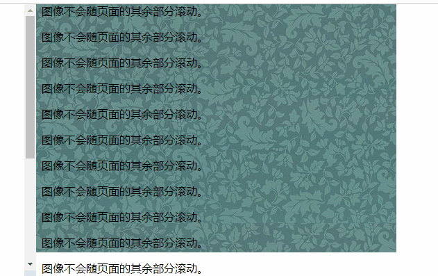
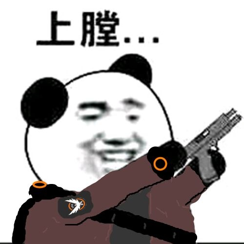
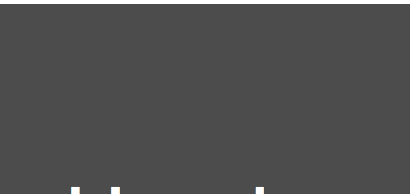
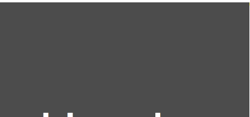

<!--视差效果，原本是一个天文学术语，当我们观察星空时，离我们远的星星移动速度较慢，离我们近的星星移动速度则较快。当我们坐在车上向车窗外 看时，也会有这样的感觉，远处的群山似乎没有在动，而近处的稻田却在飞速掠过。-->
<!-- more -->


# 滚动视差：Made In Css

## 什么叫滚动视差

**视差滚动**(Parallax Scrolling)是指让多层背景以不同的速度移动，形成立体的运动效果，带来非常出色的视觉体验。作为今年网页设计的热点趋势，越来越多的网站应用了这项技术。

视差效果，原本是一个天文学术语，当我们观察星空时，离我们远的星星移动速度较慢，离我们近的星星移动速度则较快。当我们坐在车上向车窗外 看时，也会有这样的感觉，远处的群山似乎没有在动，而近处的稻田却在飞速掠过。许多游戏中都使用视差效果来增加场景的立体感。说的简单点就是网页内的元素在滚动屏幕时发生的位置的变化，然而各个不同的元素位置变化的速度不同，导致网页内的元素有层次错落的错觉，这和我们人体的眼球效果很像。我看到多家产品商用视差滚动效果来展示产品，从不同的空间角度和用户体验，起到了非常不错的效果。

通过一个很长的网页页面，其中利用一些令人惊叹的插图和图形，并使用视差滚动（Parallax Scrolling）效果，让多层背景以不同的速度移动，形成立体的运动效果，带来非常出色的视觉体验。完美的展示了一个复杂的过程，让你犹如置身其中。固定背景不让它随着滚动轴移动，但包含背景的容器是跟着滚动的，所造成的视觉差异看起来就像跟转换场景一样。

## CSS的背景特性

纯CSS制作滚动视差的特效，依赖于CSS的一个属性

```$xslt
 background-attachment:fixed
```
 background-attachment属性设置背景图像是否固定或者随着页面的其余部分滚动。常用的值有以下几种：
 
 * scroll : 默认值,背景会随着页面其余部分的滚动而滚动。
 * inherit : 常用,规定该元素从父元素继承background-attachment属性
 * fixed: 当页面的其余部分滚动时，背景图像不会移动
 
 观察一下最后一个属性**fixed**,[这里](http://www.w3school.com.cn/tiy/t.asp?f=csse_background-attachment)可以看到一个比较草率的效果。
 



好的本篇文章到此结束，谢谢观看。



## Coding

好的好的，先把枪放下，放下。

我们新建一个HTML页面来尝试一下。首先搭建一个很草率的DOM:
```$xslt
   <div>
        <section class="g-word">Header</section>
        <section class="g-img1">IMG1</section>
        <section class="g-word">Content1</section>
        <section class="g-img2">IMG2</section>
        <section class="g-word">Content2</section>
        <section class="g-img3">IMG3</section>
        <section class="g-word">Footer</section>
    </div>
```

然后写一下它的CSS，这里为了引入方便用了SASS，当然改成源生的CSS也一样。
```$xslt
 $img1: 'http://pic7.photophoto.cn/20080407/0034034859692813_b.jpg';
    $img2: 'http://up.enterdesk.com/edpic_source/21/00/00/210000f8e772d7fc0758e67ae4b48807.jpg';
    $img3: 'https://images.unsplash.com/photo-1440688807730-73e4e2169fb8?dpr=1&auto=format&fit=crop&w=1500&h=1001&q=80&cs=tinysrgb&crop=';
    section {
        height: 100vh;
        background: rgba(0, 0, 0, .7);
        color: #fff;
        line-height: 100vh;
        text-align: center;
        font-size: 20vh;
    }

    .g-img1 {
        background-image: url($img1);
        background-size: cover;
        background-position: center center;

    }

    .g-img2 {
        background-image: url($img2);
        background-size: cover;
        background-position: center center;
    }

    .g-img3 {
        background-image: url($img3);
        background-size: cover;
        background-position: center center;
    } 
```
好的，来看下效果：



我的内心毫无波动，也不太想笑。

这尼玛不就是普通的DIV叠DIV一起打架么，你说个锤子你说。

不要着急，现在我们给每个img的CSS加上background-attachment: fixed;



怎么样，可以看见，当我们滚动页面的时候，背景图片是不会随着滚动的。用三个图片分割了三个Section,
正好在留白处进行了滚动视差处理，整个页面就不显得那么呆板了。

emmm,可能能用来做一些博客的首页。

最后附上最终的文件代码。

```$xslt
<template>
    <div>
        <section class="g-word">Header</section>
        <section class="g-img1">IMG1</section>
        <section class="g-word">Content1</section>
        <section class="g-img2">IMG2</section>
        <section class="g-word">Content2</section>
        <section class="g-img3">IMG3</section>
        <section class="g-word">Footer</section>
    </div>
</template>
<style lang="scss">
    $img1: 'http://pic7.photophoto.cn/20080407/0034034859692813_b.jpg';
    $img2: 'http://up.enterdesk.com/edpic_source/21/00/00/210000f8e772d7fc0758e67ae4b48807.jpg';
    $img3: 'https://images.unsplash.com/photo-1440688807730-73e4e2169fb8?dpr=1&auto=format&fit=crop&w=1500&h=1001&q=80&cs=tinysrgb&crop=';
    section {
        height: 100vh;
        background: rgba(0, 0, 0, .7);
        color: #fff;
        line-height: 100vh;
        text-align: center;
        font-size: 20vh;
    }

    .g-img1 {
        background-image: url($img1);
        background-attachment: fixed;
        background-size: cover;
        background-position: center center;

    }

    .g-img2 {
        background-image: url($img2);
        background-attachment: fixed;
        background-size: cover;
        background-position: center center;
    }

    .g-img3 {
        background-image: url($img3);
        background-attachment: fixed;
        background-size: cover;
        background-position: center center;
    }
</style>
```


